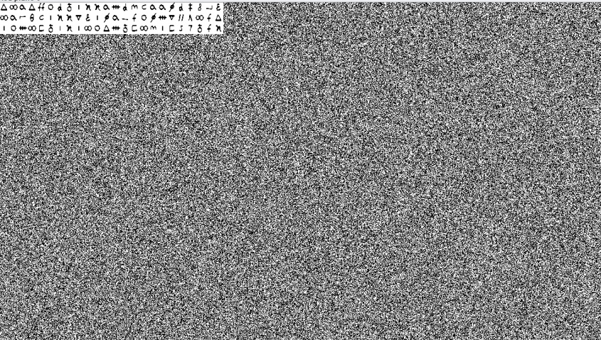

# KQCTF
These are the writeups for the KQCTF 2021
# Shes a killed queen

We have an image which is corrupted, and when we try to open the image, we are greeted with errors. 
When we use the pngcheck tool it gives width and height as 0, but on further inspection we see that the CRC has not been tampered with.

Now, we open the hex editor -
https://hexed.it

.jpg)

The highlighted portion is the CRC with which we can find the height and width of the image before it was tampered with.
The CRC is calculated using the IHDR chunk which includes the height and width of the image, so we can try to bruteforce the dimensions and calculate the corresponding CRC. When the CRC that we calculate matches the CRC in the image, we can confidently say that we have obtained the correct dimensions of the image.

Below is a script which bruteforces the dimensions and calculates the corresponding CRC using the zlib library.

NOTE: I added a nice little progress bar, so you might need to install the required library.
```bash
python3 -m pip install progress
```

```py
#!/usr/bin/env python3
from progress.bar import IncrementalBar                          # for the nice little progress bar
from pwn import *                                                # to use the p32 feature so we don't have to deal with adding the dimensions to IHDR manually
from zlib import crc32                                           # to calculate the crc
bar = IncrementalBar('Brute forcing dimesnsions', max=2000*2000) # nice little progress bar
required_crc = 0x3B8B7C12                                        # from the image
for width in range(2000):                                        # nested loop for dimensions
    for height in range(2000):
        # setup the IHDR chunk of the image using our new dimensions
        ihdr = b"\x49\x48\x44\x52" + p32(width, endian='big') + p32(height, endian='big') + b"\x08\x06\x00\x00\x00"
        # print(ihdr.hex())                                      # for debug
        crc = crc32(ihdr)                                        # calculate the CRC for our new IHDR chunk
        bar.next()                                               # update the progress bar
        if crc == required_crc:
            print()                                              # if we have the correct CRC means we have correct dimensions, so we print them (duh!)
            print(width, height)
bar.finish()
```

After running the code we get the height and width as - 
Width: 1200, Height 675

So when we change the dimensions from hex editor/modsize we get this image:

NOTE: While changing the image dimensions, make sure you convert the numbers to hex first!


From here on it becomes a stegnography challenge. We tried several stego tools and while using stegsolve on this we find a cipher:



Since the challenge name was related to a queen and so was the image, we can search for "queen cipher" and the first link we click on matches the symbols in the image. So we can just decode it there.

The link of website I used: https://www.dcode.fr/mary-stuart-code

And we get the flag!

NOTE: Join the words using underscores

Flag: `kqctf{SHES_A_KILLED_QUEEN_BY_THE_GUILLOTINE_RANDOMCHRSIADHFKILIHASDKFHQIFPXKRL}`
